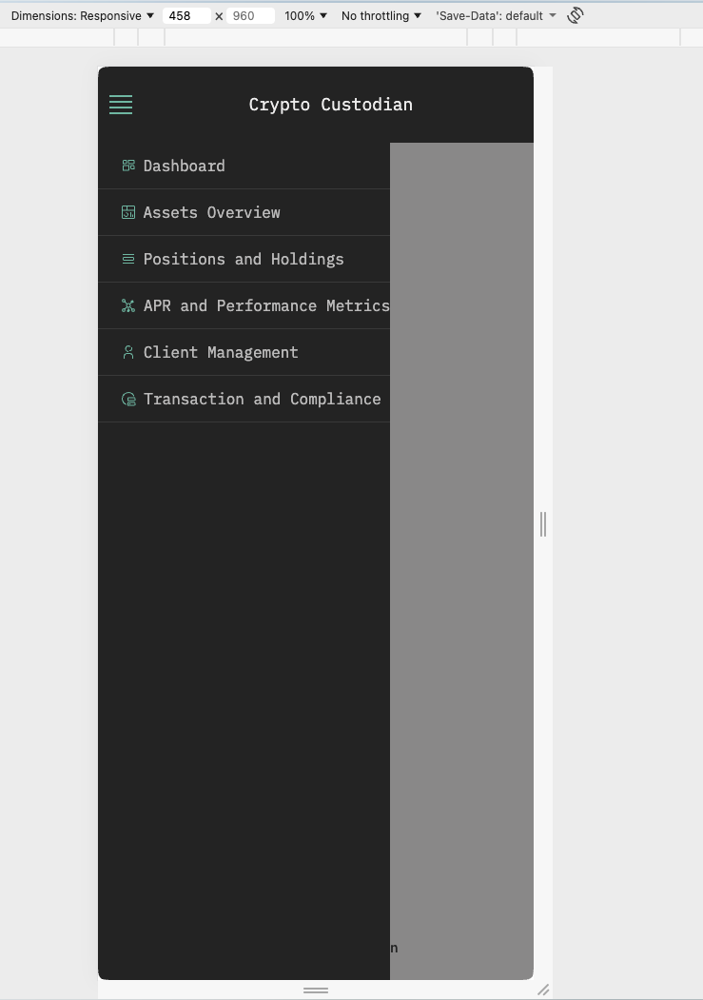
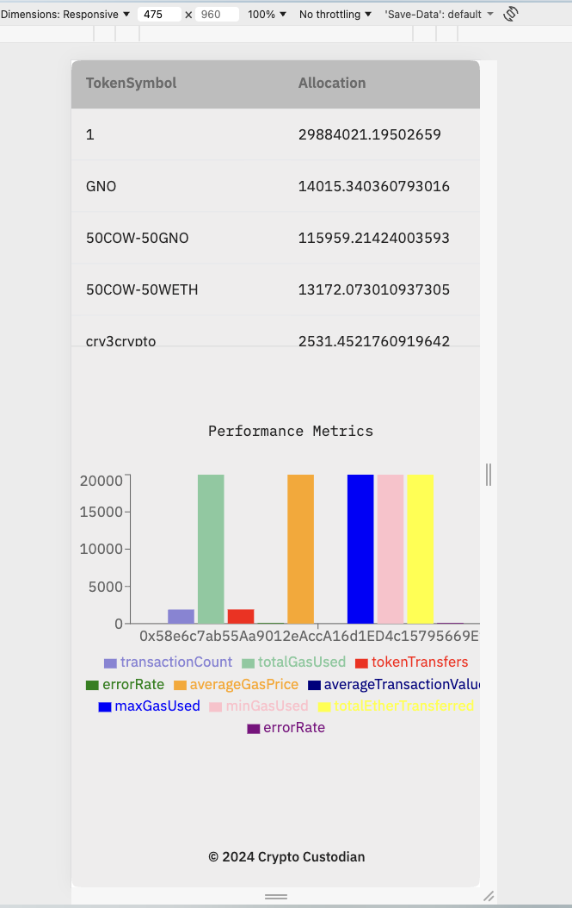

<a id="readme-top"></a>

<!-- PROJECT LOGO -->
<br />
<div align="center">

  <h1 align="center">CryptoCustodian Platform</h3>

  <p align="center">A modular full-stack Web3 portfolio analytics platform that transforms raw Ethereum transaction data into actionable portfolio intelligence. The system combines a scalable Next.js dashboard, Node.js analytics APIs, and on-chain data pipelines to deliver production-grade digital asset insights with performance-optimized UX.
    <br />
    <a href="https://github.com/am-ramona/crypto-custodian-platform"><strong>Explore the docs »</strong></a>
    <br />
    <br />
    <a href="https://github.com/am-ramona/crypto-custodian-platform">View Demo</a>
    &middot;
    <a href="https://github.com/am-ramona/crypto-custodian-platform/issues/new?labels=bug&template=bug-report---.md">Report Bug</a>
    &middot;
    <a href="https://github.com/am-ramona/crypto-custodian-platform/issues/new?labels=enhancement&template=feature-request---.md">Request Feature</a>
  </p>
</div>

<!-- TABLE OF CONTENTS -->
<details>
  <summary>Table of Contents</summary>
  <ol>
    <li>
      <a href="#about-the-project">About The Project</a>
      <ul>
        <li><a href="#why-this-project-matters">Why This Project Matters</a></li>
        <li><a href="#system-architecture">System Architecture</a></li>
        <!-- <li><a href="#my-contribution">My Contribution </a></li> -->
         <li><a href="#web3-analytics-engine">Web3 Analytics Engine</a></li>
        <li><a href="#key-features">Key Features</a></li>
        <li><a href="#built-with">Built With</a></li>
        <li><a href="#architecture-overview">Architecture Overview</a></li>
        <li><a href="#architecture-highlights">Architecture Highlights</a></li>
        <li><a href="#example-workflow">Example Workflow</a></li>
        <li><a href="#what-i-learned">What I Learned</a></li>
        <li><a href="#repositories">Repositories</a></li>
      </ul>
    </li>
    <li>
      <a href="#getting-started">Getting Started</a>
      <ul>
        <li><a href="#prerequisites">Prerequisites</a></li>
        <li><a href="#installation">Installation</a></li>
      </ul>
    </li>
    <!-- <li><a href="#usage">Usage</a></li> -->
    <li><a href="#roadmap">Roadmap</a></li>
  </ol>
</details>

<!-- ABOUT THE PROJECT -->
## About The Project

![Product Name Screen Shot][desktop-screenshot] <!-- (https://url.com)  -->
<!-- ![Product Name Screen Shot][mobile-screenshot] -->
<!-- ![Product Name Screen Shot][mobile2-screenshot] -->
</div>


<span>A production-style crypto portfolio dashboard creating CryptoCustodian architecture with intuitive UX, scalable Next.js frontend, API-driven Node Backend, real-time data visualization, and testing-first engineering.
<br/><br />
Built as part of the CryptoCustodian project architecture to demonstrate real-world Web3 system design across frontend, backend, and data layers.</span>

<p align="right">(<a href="#readme-top">back to top</a>)</p>

### Why This Project Matters

Managing digital assets requires clarity, performance, and trust.

This platform shows how to build a real production-style Web3 analytics system that:

* Aggregates on-chain data
* Computes portfolio intelligence
* Presents insights through fast, intuitive dashboards
* Maintains scalability and clean architecture

It reflects the kind of systems used by DAO treasuries, custodians, and Web3 asset platforms.

<p align="right">(<a href="#readme-top">back to top</a>)</p>

### Repositories

This project is organized into three repositories:

* [crypto-custodian-dashboard](https://github.com/am-ramona/crypto-custodian-dashboard/tree/d15c9a27b116d92128529210ee51098ffe650542) → Next.js React dashboard
* [crypto-custodian-api](https://github.com/am-ramona/crypto-custodian-api/tree/afad33fa4102cc4667ea32121901776ec0512399) → Node.js analytics API
* [crypto-custodian-platform](https://github.com/am-ramona/crypto-custodian-platform/tree/main) → Architecture, documentation, orchestration

Each repo demonstrates a different layer of a production Web3 system.

<p align="right">(<a href="#readme-top">back to top</a>)</p>

### Key Features

🔹 <b>Portfolio Analytics Dashboard</b>

* Real-time asset allocation visualization
* Multi-token portfolio tracking
* Chart-driven UX using Chart.js & D3 scale
* Data-intensive dashboard optimization

🔹 <b>Scalable API Architecture</b>

* REST APIs with Node.js + Express
* Sequelize ORM with SQLite / MySQL
* Asset analytics aggregation layer
* Middleware-based request handling

🔹 <b>Production-Grade Frontend Architecture</b>

* Next.js + TypeScript App Router
* Component-driven design system approach
* Performance-optimized rendering
* Testing with Jest + UI testing

🔹 <b>Engineering Quality</b>

* Unit + integration testing
* ESLint + Prettier + Husky
* CI-ready project structure
* Clean architecture separation

<p align="right">(<a href="#readme-top">back to top</a>)</p>

### Built With

#### Frontend

* Next.js
* React
* TypeScript
* Chart.js
* TailwindCSS
* Jest

#### Backend

* Node.js
* Express
* Sequelize
* SQLite / MySQL
* Supertest

#### Web3

* Etherscan API
* Ethereum transaction analytics

<!-- * [![React][React.js]][React-url]
* [![Javascript][javascript.com]][Javascript-url]
* [![Web3 UX flows][web3uxflows.js]][Web3UXFlows-url]
* [![Solidity][Soliditylang.org]][Solidity-url]
* [![Hardhat][Hardhat.org]][Hardhat-url]
* [![Ethers.js][Ethers.io]][Ethers-url]
* [![Pinata][Pinata.cloud]][Pinata-url]
* [![Pollinations AI][Pollinations.ai]][Pollinations-url]
* [![Node][Node.js]][Node-url] -->

<p align="right">(<a href="#readme-top">back to top</a>)</p>

### Architecture Overview

#### System Overview
<!-- ![Product Architecture Screen Shot][architecture-screenshot] -->
```
Frontend (Next.js + TypeScript)
        ↓
API Layer (Node.js + Express + Sequelize)
        ↓
Blockchain Data Sources + Off-chain Analytics
        ↓
Portfolio Dashboard & Reporting UX
```

A modular full-stack Web3 analytics platform that ingests on-chain data, computes portfolio intelligence, and delivers a high-performance dashboard UI for digital asset management.

The repository contains:

* Portfolio Dashboard Frontend
* API & Data Integration Layer
* Testing Infrastructure
* Architecture Documentation

Sub-repos:

* crypto-custodian-dashboard
* crypto-custodian-api

#### 🔹 Core Components

1. <b>Frontend Platform</b>

* Next.js + TypeScript dashboard
* Real-time portfolio visualization
* Accessible design system
* Optimized Core Web Vitals
* Chart.js + D3-scale analytics UI

2. <b>Backend Analytics API</b>

* Node.js + Express services
* Portfolio calculation engine
* Asset allocation engine
* Performance metrics engine
* Sequelize ORM (SQLite/MySQL)
* REST API layer

3. <b>Web3 Data Pipeline</b>

* Transaction ingestion via Etherscan API
* Normalization → analytics → aggregation
* Token-level analytics & metrics

#### 🔹 Data Flow

1. Fetch on-chain transactions via Etherscan API
2. Normalize & process portfolio state
3. Compute allocation & performance metrics
4. Store processed data
5. Serve insights via REST API
6. Render optimized UI dashboard ( Charts & Views )

#### 🔹 Architecture Highlights

✔ Modular full-stack architecture
✔ Real-time data-heavy UI workflows
✔ Clear separation of concerns
✔ Clean API-driven frontend
✔ Production-grade performance-first mindset
✔ Scalable Web3 analytics pipeline
✔ Production-ready engineering practices  

<p align="right">(<a href="#readme-top">back to top</a>)</p>

### Web3 Analytics Engine

Designed a production-style on-chain portfolio analytics pipeline that transforms raw Ethereum transaction data (via Etherscan APIs) into actionable treasury insights for DAO-grade dashboards.

<b>Core modules</b>

• Portfolio engine → token balances
• Allocation engine → diversification metrics
• Performance engine → gas usage, activity, efficiency analytics

Built to mirror real custody, treasury, and digital asset management systems, turning complex blockchain data into fast, intuitive user insights.

👉 Full implementation in <b>[crypto-custodian-api](https://github.com/am-ramona/crypto-custodian-api)</b>.


👉 Full implementation details in <b>[crypto-custodian-api](https://github.com/am-ramona/crypto-custodian-api)</b> repo.

<p align="right">(<a href="#readme-top">back to top</a>)</p>

### What I Learned

* Designing Web3 analytics pipelines
* Translating on-chain data into user insights
* Performance-first frontend dashboards
* Clean API architecture for Web3 platforms
* Balancing UX clarity with complex blockchain data

<p align="right">(<a href="#readme-top">back to top</a>)</p>

<!-- GETTING STARTED -->
## Getting Started

### Prerequisites

* Install [NodeJS](https://nodejs.org/en/)
* Install [npm](https://nodejs.org/en/)
* Install [Git](https://git-scm.com/)

### Installation

1. Clone/Download and run each repository
   

   ```
   git clone https://github.com/am-ramona/crypto-custodian-dashboard
   git clone https://github.com/am-ramona/crypto-custodian-api
   ```
Follow each repo’s README.


<p align="right">(<a href="#readme-top">back to top</a>)</p>

<!-- USAGE -->
<!-- ## Usage

This space is to show useful examples of how a project can be used. Additional screenshots, code examples, demos and more resources work well in this space. 

_For more examples, please refer to the [Documentation](https://example.com)_

<p align="right">(<a href="#readme-top">back to top</a>)</p> -->

<!-- ROADMAP -->
## Roadmap

<!-- - [x] Add Changelog -->
* [ ] Multi-chain analytics
* [ ] Real-time websocket updates
* [ ] Advanced risk metrics
* [ ] Gas optimization recommendations
* [ ] Wallet clustering analysis

See the [open issues](https://github.com/am-ramona/crypto-custodian-platform/issues) for a full list of proposed features (and known issues).

<p align="right">(<a href="#readme-top">back to top</a>)</p>

<!-- LICENSE -->
<!-- ## License

Distributed under the Unlicense License. See `LICENSE.txt` for more information.

<!-- MARKDOWN LINKS & IMAGES -->
<!-- https://www.markdownguide.org/basic-syntax/#reference-style-links -->

[desktop-screenshot]: images/crypto-custodian-dashboard.png
[mobile-screenshot]: images/crypto-custodian-mobile.png
[mobile2-screenshot]: images/crypto-custodian-mobile-2.png
[architecture-screenshot]: src/assets/images/Miro_design-architecture.png

[React.js]: https://img.shields.io/badge/React%20-%20Frontend%20Framework-20232A?style=for-the-badge&logo=react&logoColor=61DAFB
[React-url]: https://reactjs.org/
[web3uxflows.js]: https://img.shields.io/badge/UX-8A2BE2?style=for-the-badge&logo=ux&logoColor=61DAFB&label=Web3%20UX%20flows
[Web3UXFlows-url]: https://coinbound.io/web3-ux-design-guide/
[Javascript.com]: https://img.shields.io/badge/JavaScript-React%20and%20Testing-F7DF1E?style=for-the-badge&logo=javascript
[Javascript-url]: https://javascript.com
[Hardhat.org]: https://img.shields.io/badge/Hardhat%20-%20Development%20Framework-8C8C8C?style=for-the-badge&logo=hardhat
[hardhat-url]: https://hardhat.org/
[Ethers.io]:  https://img.shields.io/badge/Ethers.js%20-%20Blockchain%20Interaction-2B2B2B?style=for-the-badge&logo=ethers
[Ethers-url]: https://docs.ethers.io/v5/
[Soliditylang.org]: https://img.shields.io/badge/Solidity%20-%20Smart%20Contracts-3DDC84?style=for-the-badge&logo=solidity
[Solidity-url]: https://soliditylang.org/
[Pinata.cloud]:  https://img.shields.io/badge/Pinata%20-%20IPFS-4A90E2?style=for-the-badge&logo=ipfs
[Pinata-url]: https://pinata.cloud/
[Pollinations.ai]: https://img.shields.io/badge/Pollinations%20AI%20-%20AI%20Models-6A5ACD?style=for-the-badge&logo=ai
[Pollinations-url]: https://pollinations.ai/
[Node.js]: https://img.shields.io/badge/Node-Server-58a846?style=for-the-badge&logo=node.js&logoColor=58a846
[Node-url]: https://nodejs.org/
